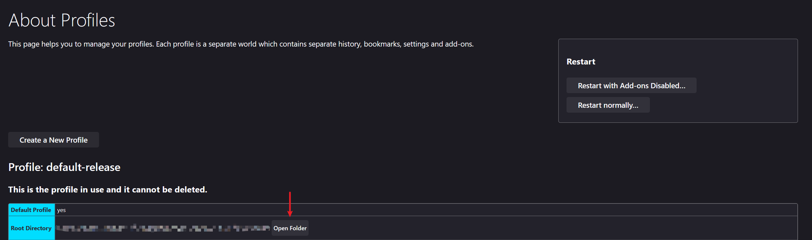
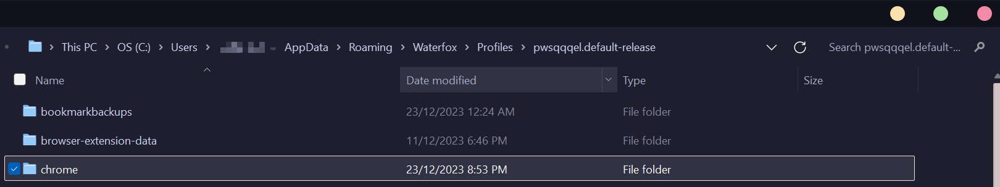

# MeowBot_Firefox-UI

A simple and minimalistic firefox theme

## Privacy Tab

- Tab only shown as icon
- Hover will show the full information of the tab

## Add-On
[Adaptive Tab Bar Color](https://addons.mozilla.org/en-US/firefox/addon/adaptive-tab-bar-colour/) use this firefox Add-on to get the best result

## Installation

1. Type about:config into your URL bar. Click on the I accept the risk button if you're shown a warning.
2. Seach for toolkit.legacyUserProfileCustomizations.stylesheets and set it to true.
3. Go to your profile folder about:profiles
  
1. Copy the chrome folder into your profile and restart Firefox
   
2. Customise everything to your liking. (optional)

### Thanks to
Some code refer from
[Cascadade Firefox Css](https://github.com/andreasgrafen/cascade)