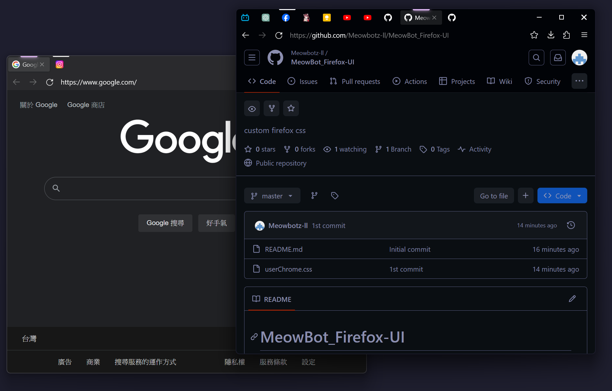

# MeowBot_Firefox-UI

A simple and minimalistic firefox theme

## Privacy Tab

- Tab only shown as icon
- Hover will show the full information of the tab

use [Adaptive Tab Bar Color](https://addons.mozilla.org/en-US/firefox/addon/adaptive-tab-bar-colour/) firefox Add-on to get the best result

Some code modified from
[Cascadade Firefox Css](https://github.com/andreasgrafen/cascade)

## Installation
1. Type about:config into your URL bar. Click on the I accept the risk button if you're shown a warning.
2. Seach for toolkit.legacyUserProfileCustomizations.stylesheets and set it to true.
3. Go to your profile folder:
   - Linux: $HOME/.mozilla/firefox/######.default-release/
   - MacOS: Users/[USERNAME]/Library/Application Support/Firefox/Profiles/######.default-release
   - Windows: C:\Users\[USERNAME]\AppData\Roaming\Mozilla\Firefox\Profiles\######.default-release
4. Copy the chrome folder into your profile and restart Firefox
5. Customise everything to your liking. (optional)