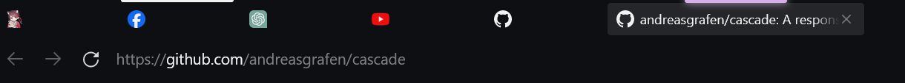

# MeowBot_Firefox-UI

A simple and minimalistic firefox theme

[Feature](#privacy-tab) # [Installation](#installation) # [Add-On](#add-on) # [Thanks to](#thanks-to)

## Privacy Tab

- Tab only shown as icon
- Hover will show the full information of the tab

## Installation

1. Type about:config into your URL bar. Click on the I accept the risk button if you're shown a warning.
2. Seach for toolkit.legacyUserProfileCustomizations.stylesheets and set it to true.
3. Go to your profile folder about:profiles
   
4. copy the chrome folder to the root profile directory.
   
5. Customise everything to your liking. (optional)

## Add-On

[Adaptive Tab Bar Color](https://addons.mozilla.org/en-US/firefox/addon/adaptive-tab-bar-colour/) use this firefox Add-on to get the best result

### Thanks to

[Adaptive Tab Bar Color](https://addons.mozilla.org/en-US/firefox/addon/adaptive-tab-bar-colour/)
[Cascadade Firefox Css](https://github.com/andreasgrafen/cascade)
